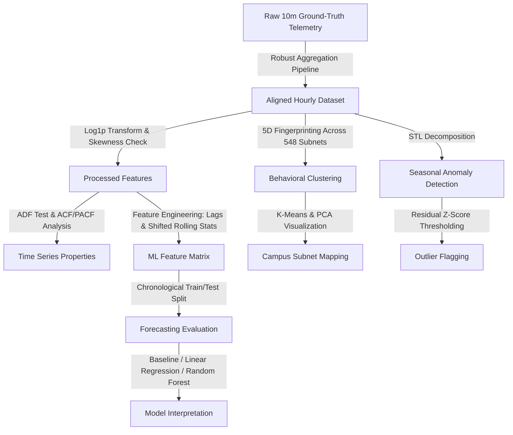

# Campus Network Telemetry: Time Series Forecasting, Unsupervised Profiling, & Anomaly Detection

This repository hosts a production-grade time-series engineering and machine learning project. Using multi-resolution campus network telemetry (548 subnets aggregated over 10-minute, 1-hour, and 1-day intervals), this project establishes a robust end-to-end framework for data alignment, feature engineering, supervised forecasting, unsupervised clustering, and seasonal anomaly detection.

---

##  Project Architecture & Workflow



---

##  Pipeline Phases & Engineering Rigor

### 1. Data Audit & Boundary Alignment (Phase 1)
* **The Challenge:** A standard correlation check revealed a clock-drift boundary shift in the raw hourly telemetry files around hour index $480$. Comparing raw hourly telemetry against resampled 10-minute ground truth showed a significant alignment drop (MAPE spike).
* **The Root Cause:** Gaps in the raw hourly index table paired with minor clock drifts led to a permanent 1-hour indexing offset.
* **The Solution:** Constructed a robust custom aggregation pipeline (`get_clean_subnet_data`) that directly processes the 10-minute ground-truth files. This pipeline reconstructs a contiguous hourly index via linear interpolation before resampling, guaranteeing zero alignment error and preventing index mismatch.

### 2. Distribution & Outlier Diagnostics
* **Skewness Correction:** Network flow counts exhibit a severe right-skew ($Skew \approx 2.58$). Applying a $\log(1 + x)$ transform normalized the distribution, reducing skewness to $-0.32$ and kurtosis from $9.64$ to $-0.09$.
* **Outlier Audits:** Z-score thresholding ($3\sigma$) on raw data missed critical outliers due to the inflating effect of heavy tails on the sample standard deviation. Applying the Interquartile Range (IQR) method on log-transformed data isolated true network anomalies.

### 3. Time Series Foundations (Phase 2)
* **Stationarity:** An Augmented Dickey-Fuller (ADF) test rejected the unit root null hypothesis with a p-value of $6.0 \times 10^{-6}$ (ADF statistic of $-5.297$, far exceeding the $1\%$ critical value of $-3.435$), confirming the statistical stationarity of the hourly flow counts.
* **Temporal Autocorrelation:** Autocorrelation (ACF) and Partial Autocorrelation (PACF) plots analyzed up to 168 lags (1 week) revealed strong daily seasonality (spikes at lag 24) and weekly seasonality (spikes at lag 168).

### 4. Feature Engineering & Target Leakage Prevention (Phase 3)
To build a machine learning matrix, the following features were engineered:
* **Autoregressive Lags:** Lags 1, 2, 24, and 168 to capture short-term, daily, and weekly temporal dependencies.
* **Shifted Rolling Windows:** 6-hour and 24-hour rolling averages and standard deviations. 
  > [!IMPORTANT]
  > To prevent target leakage, all rolling window calculations were shifted by one step (`.shift(1)`), ensuring no current-step information was leaked into the historical features.
* **Calendar Indicators:** Cycle features including hour of day, day of week, and weekend flags.

### 5. Forecasting Benchmark & Model Comparison (Phase 4)
Using a chronological test split (reserving the final 14 days for test evaluation to preserve temporal order):
* **Linear Regression** outperformed **Random Forest** ($R^2$ score of `0.8634` vs `0.8287`). 
* **Interpretation:** Network traffic exhibits highly linear autoregressive properties (strongly dominated by `lag_1` and `lag_24`). Linear models extrapolate these trends directly out-of-sample, whereas tree-based ensembles (Random Forest) are bound by the range of training targets and cannot extrapolate out-of-sample spikes or drops.
* **Feature Importance:** Standardized coefficients from Linear Regression proved that `lag_1` and `lag_24` explain the majority of model decisions, aligning with PACF behavior.

### 6. Unsupervised Campus Subnet Clustering (Phase 5)
Extracted a 5-dimensional fingerprint matrix across all 548 campus subnets:
1. `mean_flows` — Average volume.
2. `std_flows` — Volatility.
3. `weekend_ratio` — Ratio of weekend to weekday average volume.
4. `day_night_ratio` — Daytime (8 AM - 8 PM) to night-time average volume.
5. `peak_hour` — Hour of maximum average traffic.

Applying K-Means ($K=3$) and projecting into 2D via Principal Component Analysis (PCA) mapped the network into three physical profiles:
* **Cluster 0 (Workstations):** Sharp day-night cycles, weekend collapses, and daytime peaks.
* **Cluster 1 (Servers):** Extremely high continuous traffic, low volatility, and flat weekend/night profiles.
* **Cluster 2 (Residential/Dormitories):** Sustained night activity, high weekend volumes, and late-night spikes.

### 7. Seasonal Anomaly Detection (Phase 6)
* **Methodology:** Standard thresholding fails on network traffic because peak daytime traffic under normal conditions exceeds anomalous spikes on weekends.
* **Solution:** Used STL (Seasonal-Trend decomposition using LOESS) to decompose the flow counts. Calculated Z-scores on the **STL Residuals** (removing the seasonal baseline). Anomalies were flagged where $|Z_{\text{resid}}| > 3$.
* **Result:** Successfully flagged relative anomalies, such as unexpected drops during business hours and sustained traffic spikes during weekend nights, which would be invisible to static threshold models.

---

##  Summary of Key Results

| Model / Phase | Metric / Characteristic | Finding / Interpretation |
| :--- | :--- | :--- |
| **ADF Stationarity** | Statistic: `-5.296`, p-val: `6.0e-6` | Series is statistically stationary; weekly patterns are seasonal. |
| **Linear Regression** | $R^2$: **`0.8634`** | Best overall performance; effectively projects linear autoregressive features. |
| **Random Forest** | $R^2$: `0.8287` | Underperforms linear regression; struggles with out-of-sample trend extrapolation. |
| **STL Anomalies** | Threshold: $|Z_{\text{resid}}| > 3$ | Detects relative deviations (e.g., weekend night spikes) rather than absolute peaks. |
| **Subnet Profiles** | $K=3$ Clusters | Classifies subnets into Workstations (weekend drop), Servers (flat/high), and Dorms (night active). |

---

##  Running the Notebook

To reproduce the analysis, execute the Jupyter notebook located in the repository root:

```bash
jupyter notebook phase_3_time_series.ipynb
```

### Dependencies
Ensure you have the following packages installed:
* `numpy`
* `pandas`
* `matplotlib`
* `scikit-learn`
* `statsmodels`
